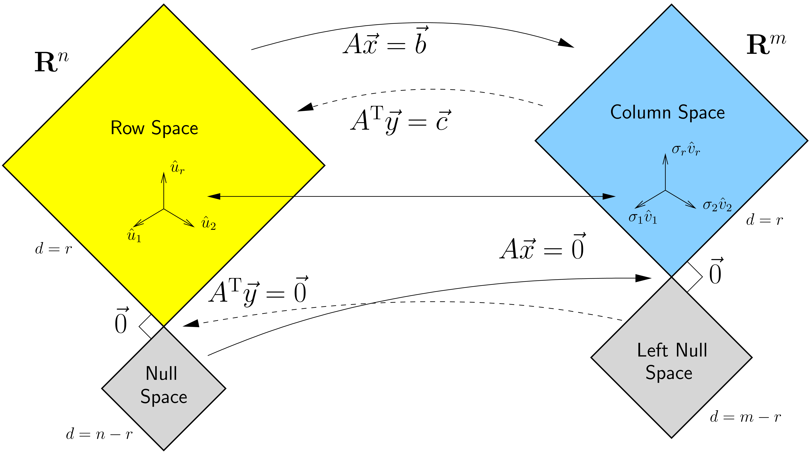

## LU factorization
LU factorization is very useful when solving linear equations.

## The four fundamental subspaces
The four fundamental subspaces governs the solutions in linear algebra.


$$
\begin{bmatrix}
1 & 2 & 3\\
4 & 5 & 6\\
7 & 8 & 9\\
\end{bmatrix}
$$




```python
def matmul(A, B):
  pass
```